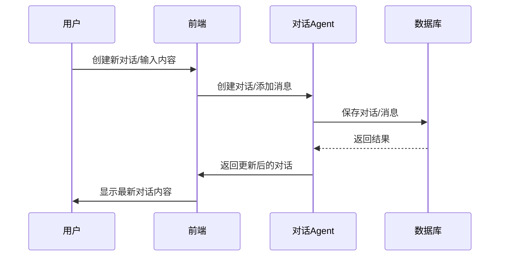
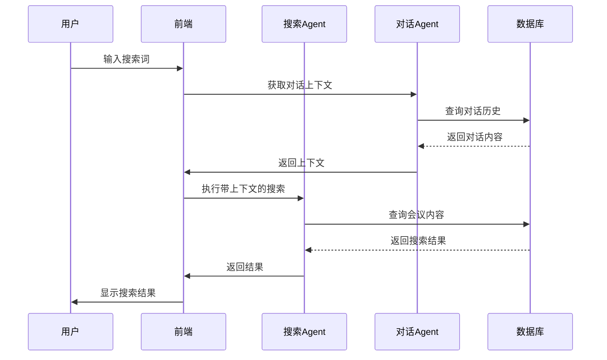

# 会议纪要智能体完整设计文档

## 设计概述

本文档整合了会议纪要智能体的完整设计方案，以对话历史系统为核心参考，结合项目整体架构和技术实现细节，形成统一的设计规范。

## 设计理念

### 核心设计原则
1. **极简主义**: 个人使用场景，避免过度设计
2. **专注核心**: 只做语音转写和搜索两个核心功能
3. **数据驱动**: 向量化存储实现语义搜索
4. **异步处理**: 保证用户体验，避免长时间等待
5. **对话连续性**: 支持对话历史管理和上下文保持

### 设计目标
- **易用性**: 最小化用户操作，一键上传即可完成
- **准确性**: 高质量的语音转写结果
- **可检索性**: 强大的语义搜索能力
- **可扩展性**: 为未来功能扩展留出接口
- **连续性**: 支持在历史对话基础上继续交流

## 架构设计

### 整体架构哲学
采用"后端重，前端轻"的设计理念：
- 后端承担所有复杂处理逻辑
- 前端只负责简单的数据展示和交互
- 数据层通过向量数据库增强搜索能力
- 对话历史系统提供上下文管理

### 技术选型考量

#### 为什么选择Java + FunASR？
- **Java生态**: 成熟稳定，适合AI服务集成
- **FunASR**: 专注中文语音识别，开源免费
- **性能**: JVM良好的性能表现
- **社区**: 丰富的第三方库支持

#### 为什么选择PostgreSQL + pgvector？
- **一体化**: 数据和向量存储统一，简化架构
- **成本**: 无需额外部署向量数据库
- **易用性**: SQL熟悉的操作方式
- **性能**: pgvector对向量检索优化良好

#### 为什么选择AgentScope框架？
- **模块化**: 清晰的Agent架构设计
- **可扩展**: 易于添加新的Agent和工具
- **集成友好**: 与Spring Boot无缝集成
- **开发效率**: 减少底层代码编写量

## 数据架构设计

### 核心数据表设计

#### 会议纪要表（meeting_minutes）
```sql
CREATE TABLE meeting_minutes (
    id BIGSERIAL PRIMARY KEY,
    title VARCHAR(255) NOT NULL,
    file_path VARCHAR(500) NOT NULL,
    file_size BIGINT,
    duration INTEGER,
    transcription TEXT,
    created_at TIMESTAMP DEFAULT CURRENT_TIMESTAMP,
    updated_at TIMESTAMP DEFAULT CURRENT_TIMESTAMP,
    status VARCHAR(20) DEFAULT 'processing' -- processing/completed/failed
);
```

#### 会议向量表（meeting_vectors）
```sql
CREATE TABLE meeting_vectors (
    id BIGSERIAL PRIMARY KEY,
    meeting_id BIGINT REFERENCES meeting_minutes(id) ON DELETE CASCADE,
    content TEXT NOT NULL,
    embedding VECTOR(1536),
    chunk_index INTEGER,
    created_at TIMESTAMP DEFAULT CURRENT_TIMESTAMP
);
```

#### 对话表（dialogues）
```sql
CREATE TABLE dialogues (
    id BIGSERIAL PRIMARY KEY,
    title VARCHAR(255) NOT NULL,
    created_at TIMESTAMP DEFAULT CURRENT_TIMESTAMP,
    updated_at TIMESTAMP DEFAULT CURRENT_TIMESTAMP,
    status VARCHAR(20) DEFAULT 'active', -- active/archived/inactive
    user_id VARCHAR(255),
    imported BOOLEAN DEFAULT FALSE,
    meeting_id BIGINT REFERENCES meeting_minutes(id) ON DELETE SET NULL
);
```

#### 对话消息表（dialogue_messages）
```sql
CREATE TABLE dialogue_messages (
    id BIGSERIAL PRIMARY KEY,
    dialogue_id BIGINT REFERENCES dialogues(id) ON DELETE CASCADE,
    role VARCHAR(20) NOT NULL, -- user/assistant
    content TEXT NOT NULL,
    timestamp TIMESTAMP DEFAULT CURRENT_TIMESTAMP,
    message_type VARCHAR(50) DEFAULT 'text', -- text/search/note/transcription
    meeting_context_id BIGINT REFERENCES meeting_minutes(id) ON DELETE CASCADE
);
```

### 索引设计
```sql
-- 全文搜索索引
CREATE INDEX idx_meeting_minutes_search ON meeting_minutes USING gin(to_tsvector('english', title || ' ' || transcription));

-- 向量索引
CREATE INDEX idx_meeting_vectors_embedding ON meeting_vectors USING ivfflat(embedding vector_cosine_ops);

-- 对话状态索引
CREATE INDEX idx_dialogues_status ON dialogues(status, updated_at DESC);

-- 消息时间索引
CREATE INDEX idx_dialogue_messages_timestamp ON dialogue_messages(dialogue_id, timestamp);
```

## 功能模块设计

### 1. 文件处理模块

**设计考量**:
- 为什么只支持MP4？因为这是最常见的录屏格式
- 为什么需要提取音频？分离音频可以提高识别准确率
- 为什么异步处理？避免用户长时间等待

**核心功能**:
- 文件上传验证
- 音频提取
- 异步任务队列

**AgentScope实现**:
```java
@Agent(name = "FileProcessingAgent")
public class FileProcessingAgent {
    
    @Tool(name = "processFile")
    public String processFile(MultipartFile file) {
        // 1. 验证文件类型
        if (!file.getOriginalFilename().endsWith(".mp4")) {
            throw new IllegalArgumentException("Only MP4 files are supported");
        }
        
        // 2. 创建处理任务
        MeetingTask task = createTask(file);
        
        // 3. 异步处理
        asyncProcessingService.process(task);
        
        // 4. 返回任务ID
        return String.format("{\"taskId\":\"%s\",\"status\":\"queued\"}", task.getId());
    }
    
    @Tool(name = "getTaskStatus")
    public String getTaskStatus(String taskId) {
        // 查询任务状态
        TaskStatus status = taskService.getStatus(taskId);
        return "{\"status\":\"" + status + "\"}";
    }
}
```

### 2. 语音转写模块

**设计考量**:
- 为什么选择FunASR？对中文会议场景优化好
- 为什么需要结构化输出？便于后续处理和搜索
- 为什么支持连续识别？会议通常是连续对话

**核心功能**:
- 音频预处理
- 语音识别
- 结果结构化

**AgentScope实现**:
```java
@Agent(name = "TranscriptionAgent")
public class TranscriptionAgent {
    
    @Tool(name = "transcribeAudio")
    public String transcribeAudio(String audioPath) {
        // 1. 加载音频
        Audio audio = loadAudio(audioPath);
        
        // 2. 预处理
        Audio processedAudio = preprocess(audio);
        
        // 3. 识别
        TranscriptionResult result = funASR.transcribe(processedAudio);
        
        // 4. 结构化处理
        return structureTranscription(result);
    }
    
    private String structureTranscription(TranscriptionResult result) {
        // 按说话人和时间戳组织
        StringBuilder sb = new StringBuilder();
        for (Segment segment : result.getSegments()) {
            sb.append(String.format("[%s-%s] %s: %s\n",
                segment.getStartTime(),
                segment.getEndTime(),
                speakerName(segment.getSpeakerId()),
                segment.getText()));
        }
        return sb.toString();
    }
}
```

### 3. 对话历史模块

**功能设计**:
- 显示最近10条活跃对话（按更新时间倒序）
- 创建新对话
- 在历史对话基础上继续添加内容
- 查看对话完整内容
- 手动将对话内容导入知识库

**状态管理**:
- active状态：显示在前10条
- archived状态：用户主动归档，仍可查看
- inactive状态：超过10条自动归档，数据保留

**AgentScope实现**:
```java
@Agent(name = "DialogueAgent")
public class DialogueAgent {
    
    @Tool(name = "createDialogue")
    public String createDialogue(String title, String meetingId) {
        Dialogue dialogue = new Dialogue();
        dialogue.setTitle(title);
        dialogue.setMeetingId(meetingId);
        dialogue.setStatus("active");
        
        dialogueService.save(dialogue);
        return "{\"dialogueId\":\"" + dialogue.getId() + "\"}";
    }
    
    @Tool(name = "addMessage")
    public String addMessage(String dialogueId, String role, String content) {
        DialogueMessage message = new DialogueMessage();
        message.setDialogueId(dialogueId);
        message.setRole(role);
        message.setContent(content);
        message.setTimestamp(LocalDateTime.now());
        
        // 更新对话时间戳
        dialogueService.updateTimestamp(dialogueId);
        
        messageService.save(message);
        return "{\"messageId\":\"" + message.getId() + "\"}";
    }
    
    @Tool(name =="getDialogueHistory")
    public String getDialogueHistory(String dialogueId) {
        Dialogue dialogue = dialogueService.getById(dialogueId);
        List<DialogueMessage> messages = messageService.getByDialogueId(dialogueId);
        
        Map<String, Object> result = new HashMap<>();
        result.put("dialogue", dialogue);
        result.put("messages", messages);
        
        return toJson(result);
    }
    
    @Tool(name =="importToKnowledgeBase")
    public String importToKnowledgeBase(String dialogueId) {
        // 1. 获取对话内容
        String content = aggregateDialogueContent(dialogueId);
        
        // 2. 生成向量
        float[] embedding = embeddingService.generate(content);
        
        // 3. 保存到知识库
        knowledgeService.save(content, embedding);
        
        // 4. 更新对话状态
        dialogueService.setImported(dialogueId, true);
        
        return "{\"success\":true}";
    }
}
```

### 4. 搜索模块

**搜索策略**:
- 全文搜索：关键词匹配
- 向量搜索：语义相似度
- 混合搜索：结合关键词和语义

**用户体验**:
- 搜索结果按相关性排序
- 高亮显示匹配内容
- 显示完整的会议上下文

**AgentScope实现**:
```java
@Agent(name = "SearchAgent")
public class SearchAgent {
    
    @Tool(name =="searchMeetings")
    public String searchMeetings(String query, String dialogueId) {
        // 1. 如果有对话上下文，结合上下文搜索
        String context = dialogueId ? getDialogueContext(dialogueId) : "";
        
        // 2. 全文搜索
        List<Meeting> textResults = searchService.textSearch(query);
        
        // 3. 向量搜索
        List<Meeting> vectorResults = searchService.vectorSearch(query, context);
        
        // 4. 混合排序
        List<SearchResult> mixedResults = rankResults(textResults, vectorResults, query);
        
        return toJson(mixedResults);
    }
    
    private List<SearchResult> rankResults(List<Meeting> textResults, 
                                         List<Meeting> vectorResults, 
                                         String query) {
        // 混合排序算法
        // 结合全文匹配分数和向量相似度分数
        return mixedResults.stream()
            .sorted((a, b) -> Double.compare(b.getScore(), a.getScore()))
            .collect(Collectors.toList());
    }
}
```

## 系统架构设计

### Agent架构
```
MeetingAgent (主控制器)
├── FileProcessingAgent (文件处理)
├── TranscriptionAgent (语音转写)
├── DialogueAgent (对话管理)
└── SearchAgent (智能搜索)
```

### 后端服务架构

#### 主应用类（AgentScopeApplication）
```java
@SpringBootApplication
public class AgentScopeApplication {
    public static void main(String[] args) {
        SpringApplication.run(AgentScopeApplication.class, args);
    }
}
```

#### API端点设计
```java
@RestController
@RequestMapping("/api")
public class MeetingAgent {
    
    // 文件处理
    @PostMapping("/upload")
    public ApiResponse uploadFile(@RequestParam MultipartFile file) {
        return fileAgent.processFile(file);
    }
    
    // 任务状态查询
    @GetMapping("/task/{taskId}")
    public ApiResponse getTaskStatus(@PathVariable String taskId) {
        return transcriptionAgent.getTaskStatus(taskId);
    }
    
    // 转写结果
    @GetMapping("/transcription/{meetingId}")
    public ApiResponse getTranscription(@PathVariable String meetingId) {
        return searchAgent.getMeetingContent(meetingId);
    }
    
    // 对话管理
    @PostMapping("/dialogue")
    public ApiResponse createDialogue(@RequestBody CreateDialogueRequest request) {
        return dialogueAgent.createDialogue(request.getTitle(), request.getMeetingId());
    }
    
    // 搜索
    @GetMapping("/search")
    public ApiResponse search(@RequestParam String query, 
                           @RequestParam(required = false) String dialogueId) {
        return searchAgent.searchMeetings(query, dialogueId);
    }
}
```

### 前端组件设计

#### 核心组件结构
```jsx
// App.js
function App() {
  return (
    <Layout style={{ minHeight: '100vh' }}>
      <Header>
        <Title>会议纪要智能体</Title>
      </Header>
      <Content style={{ padding: '24px' }}>
        <UploadComponent />
        <StatusComponent />
        <DialogueListComponent />
        <SearchComponent />
      </Content>
    </Layout>
  );
}
```

#### 对话列表组件
```jsx
const DialogueList = () => {
  const [dialogues, setDialogues] = useState([]);
  const [activeDialogue, setActiveDialogue] = useState(null);
  
  useEffect(() => {
    loadDialogues();
  }, []);
  
  const loadDialogues = async () => {
    const response = await api.get('/dialogues');
    setDialogues(response.data);
  };
  
  const openDialogue = (dialogue) => {
    setActiveDialogue(dialogue);
  };
  
  const createNewDialogue = (meetingId) => {
    api.post('/dialogue', { title: '新对话', meetingId })
      .then(() => loadDialogues());
  };
  
  return (
    <div>
      <List
        dataSource={dialogues}
        renderItem={item => (
          <List.Item
            onClick={() => openDialogue(item)}
            actions={[
              <Button 
                type="link" 
                onClick={(e) => {
                  e.stopPropagation();
                  handleImport(item.id);
                }}
              >
                导入知识库
              </Button>
            ]}
          >
            <List.Item.Meta
              title={item.title}
              description={formatDate(item.updated_at)}
            />
          </List.Item>
        )}
      />
    </div>
  );
};
```

## 对话历史详细设计

### 对话生命周期管理

1. **创建阶段**
   - 用户上传视频后自动创建对话
   - 支持手动创建新对话
   - 对话关联会议纪要

2. **活跃阶段**
   - 用户可以继续在对话中提问
   - 系统基于会议内容回复
   - 自动更新最后活动时间

3. **归档阶段**
   - 对话超过10条自动变为inactive
   - 用户可以手动归档对话
   - 所有数据保留

### 消息类型设计

| 消息类型 | 描述 | 用途 |
|---------|------|------|
| text | 用户输入的文本 | 普通对话 |
| search | 搜索查询 | 执行搜索 |
| note | 系统备注 | 重要信息记录 |
| transcription | 转写内容 | 会议原文引用 |

### 时序图

#### 1. 对话创建和更新时序图


#### 2. 搜索对话时序图


## 部署设计

### Docker Compose配置
```yaml
version: '3.8'

services:
  # AgentScope 后端服务
  agentscope:
    build: 
      context: ./backend
      dockerfile: Dockerfile
    ports:
      - "8080:8080"
    environment:
      - SPRING_PROFILES_ACTIVE=docker
      - DB_URL=jdbc:postgresql://postgres:5432/meeting_agent
      - DB_USERNAME=user
      - DB_PASSWORD=password
    depends_on:
      - postgres
    volumes:
      - ./backend/src:/app/src
      - model_data:/app/models

  # PostgreSQL 数据库
  postgres:
    image: postgres:15
    environment:
      POSTGRES_DB: meeting_agent
      POSTGRES_USER: user
      POSTGRES_PASSWORD: password
    volumes:
      - postgres_data:/var/lib/postgresql/data
    ports:
      - "5432:5432"

  # React 前端服务
  frontend:
    build:
      context: ./frontend
      dockerfile: Dockerfile
    ports:
      - "3000:3000"
    depends_on:
      - agentscope
    environment:
      - REACT_APP_API_URL=http://localhost:8080/api

  # Redis (可选，用于缓存)
  redis:
    image: redis:7-alpine
    ports:
      - "6379:6379"

volumes:
  postgres_data:
  model_data:
```

### 环境配置
```bash
# 开发环境
export DB_URL=jdbc:postgresql://localhost:5432/meeting_agent
export DB_USERNAME=user
export DB_PASSWORD=password
export SPRING_PROFILES_ACTIVE=dev

# 生产环境
export DB_URL=jdbc:postgresql://postgres-prod:5432/meeting_agent
export DB_USERNAME=${DB_USERNAME}
export DB_PASSWORD=${DB_PASSWORD}
export SPRING_PROFILES_ACTIVE=prod
```

## 性能设计

### 异步处理架构
- 使用消息队列处理耗时的语音转写任务
- 用户可以随时查看任务进度
- 失败重试机制保证任务完成率

### 缓存策略
- Redis缓存热点搜索结果
- 缓存最近访问的会议内容
- 缓存对话历史列表

### 数据库优化
- 合理的索引设计
- 连接池配置优化
- 定期维护和清理

## 扩展性设计

### 未来扩展点
1. **用户管理**: 添加用户系统，支持多用户
2. **批量处理**: 支持批量上传多个视频
3. **导出功能**: 导出为PDF、Word等格式
4. **多语言支持**: 添加英文语音识别
5. **实时转写**: 支持实时会议转写

### 架构扩展性
- 后端服务可以轻松水平扩展
- 数据库支持分库分表
- 向量引擎可以切换到专业向量数据库
- Agent可以动态添加和配置

## 安全性考虑

### 文件上传安全
- 文件类型验证，防止恶意文件上传
- 文件大小限制，避免服务器资源耗尽
- 病毒扫描
- 临时文件自动清理

### 数据安全
- 数据库访问权限控制
- 敏感信息加密存储
- 数据传输加密
- 定期数据备份策略

### API安全
- 身份认证和授权
- API限流
- 输入验证和过滤
- 日志记录和监控

## 监控和运维

### 日志设计
```java
@Slf4j
@RestController
@RequestMapping("/api")
public class MeetingAgent {
    
    @PostMapping("/upload")
    public ApiResponse uploadFile(@RequestParam MultipartFile file) {
        log.info("文件上传请求: {}, 大小: {}", 
                file.getOriginalFilename(), 
                file.getSize());
        
        try {
            // 处理文件
        } catch (Exception e) {
            log.error("文件处理失败: {}", file.getOriginalFilename(), e);
            throw new RuntimeException("处理失败");
        }
    }
}
```

### 健康检查
```java
@RestController
@RequestMapping("/api")
public class MeetingAgent {
    
    @GetMapping("/health")
    public ResponseEntity<Map<String, String>> health() {
        Map<String, String> status = new HashMap<>();
        
        // 检查数据库连接
        boolean dbOk = databaseHealthCheck();
        
        // 检查队列状态
        boolean queueOk = queueHealthCheck();
        
        // 检查模型服务
        boolean modelOk = modelServiceHealthCheck();
        
        status.put("status", dbOk && queueOk && modelOk ? "OK" : "ERROR");
        status.put("database", dbOk ? "OK" : "ERROR");
        status.put("queue", queueOk ? "OK" : "ERROR");
        status.put("model", modelOk ? "OK" : "ERROR");
        
        return ResponseEntity.ok(status);
    }
}
```

## 设计权衡总结

### 功能与复杂度的权衡
- 牺牲部分功能（如PPT生成）换取系统简洁
- 专注核心功能，保证质量
- 为未来扩展预留接口

### 性能与成本的权衡
- 使用现有开源技术，降低成本
- 优化关键路径，保证性能
- 合理使用缓存，平衡性能和资源

### 用户体验与技术实现的权衡
- 简化用户操作，增加技术复杂度
- 异步处理提升体验，增加系统复杂度
- 搜索功能强大，但需要学习成本
- 对话历史系统提升连续性体验

## 总结

这个综合设计方案的核心思想是"少即是多"：
- 功能上做减法，专注核心价值
- 架构上做减法，降低维护成本
- 体验上做加法，提升用户满意度
- 对话历史系统提供连续性体验

通过极简的设计实现强大的功能，结合AgentScope框架的模块化优势，为个人用户提供高效的会议纪要管理解决方案。对话历史系统的引入让用户可以在会议内容基础上进行持续交流和探索，形成完整的知识管理闭环。

---

*设计文档版本: 4.0*  
*创建日期: 2026-06-20*  
*最后更新: 2026-06-20*  
*整合来源: 2026-06-19-meeting-agent-design.md, 2026-06-19-project-framework-design.md, 2026-06-20-dialogue-history-design.md*